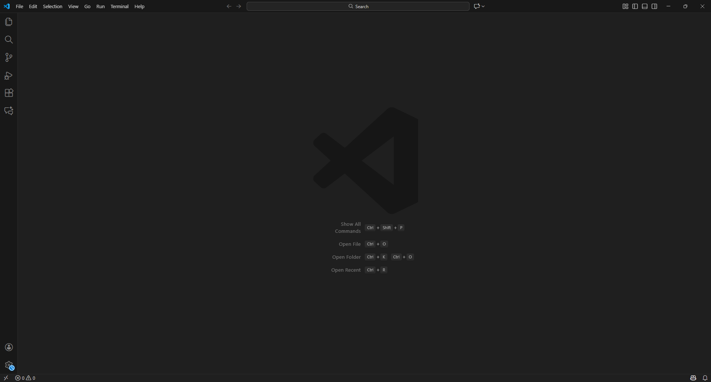

# JavaScript

> **Data:** 10 de setembro de 2026

Início no JavaScript.

---

## 🔷 VS Code

Para iniciar os exercícios de JavaScript, utilizamos o VS Code.



Foi criada uma pasta chamada "JS" e ela foi aberta pelo Explorer → Open Folder.

Para executar os arquivos .js, utilizamos o Node.js, que já estava instalado nos computadores do SENAC.

No terminal, um arquivo pode ser executado com:

```js
node NOME-DO-ARQUIVO.js
```

---

## Comandos Iniciais

### Primeiro programa

Foi criado o arquivo `01_olamundo.js`.

```js
console.log("Olá Mundo!")
```

O `console.log()` é utilizado para exibir informações no terminal.

**OBS:** O `;` não é obrigatório no JavaScript.

### Variáveis

Aprendemos duas formas principais de declarar variáveis:

```js
let a = 5
const c = 8
```

- `let` → variável cujo valor pode ser alterado.
- `const` → variável cujo valor não deve ser alterado.

**OBS:** O JavaScript diferencia letras maiúsculas de minúsculas.

Também foi apresentada a declaração com var, porém ela foi indicada como desatualizada:

```js
var d = 2
```

### Operações

Também praticamos operações matemáticas utilizando variáveis:

```js
a + b
a - b
a * b
a / b
a % b
a ** b
```

### Comentários

Os comentários podem ser escritos utilizando:

```js
// comentário
```

ou

```js
/*
   comentário
*/
```

### Exibição de texto e variáveis

Aprendemos diferentes formas de exibir valores.

A forma apresentada como mais atual utiliza **template literals**:

```js
let nome = 'Anderson'
let sobrenome = 'Wilmer'

console.log(`${nome} ${sobrenome}`)
```

Também foram apresentadas outras formas:

```js
console.log(nome, sobrenome)

console.log(nome + " " + sobrenome)
```

### Entrada de dados com readline

O `readline` permite que o programa receba dados digitados pelo usuário pelo terminal.

Para utilizá-lo:

```js
const readline = require('readline')

const rl = readline.createInterface({
    input: process.stdin,
    output: process.stdout
})
```

A função rl.question() é utilizada para fazer uma pergunta e receber a resposta do usuário:

```js
rl.question('Digite seu nome: ', (nome) => {
    console.log(`Nome: ${nome}`)
    rl.close()
})
```

- `readline` → permite receber dados pelo terminal.
- `rl.question()` → faz uma pergunta e recebe a resposta.
- `rl.close()` → encerra a entrada de dados.
