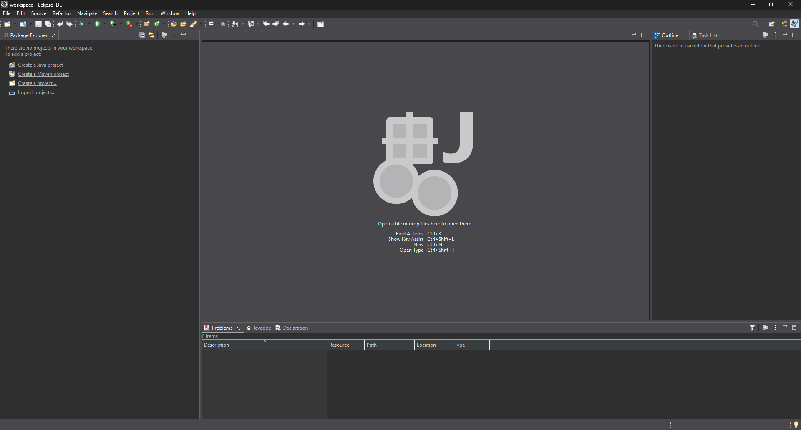
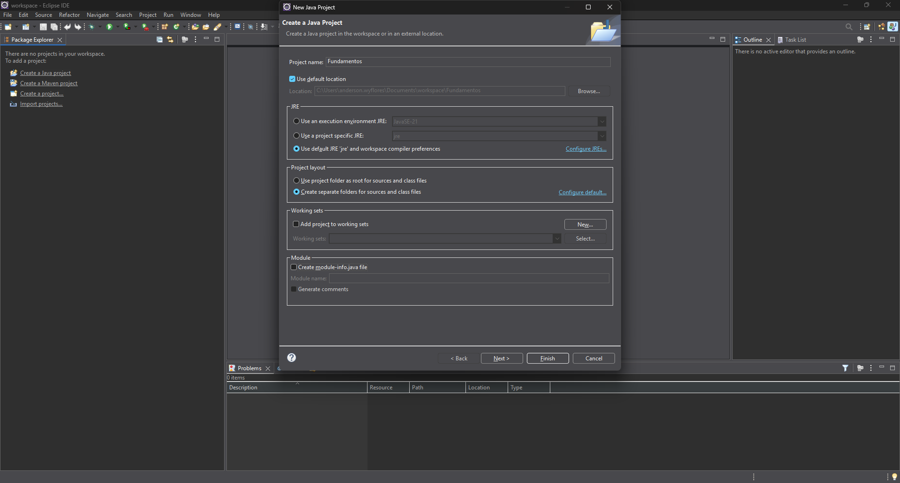
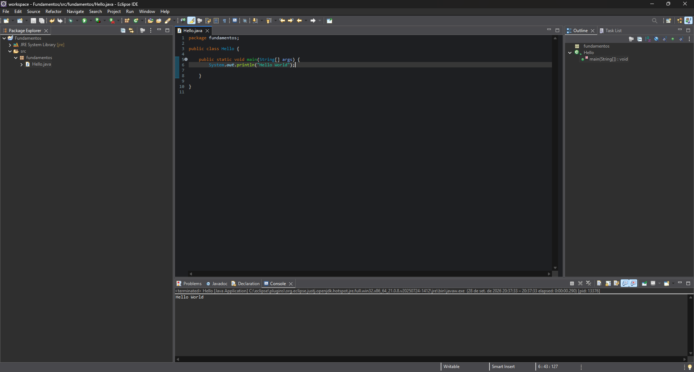
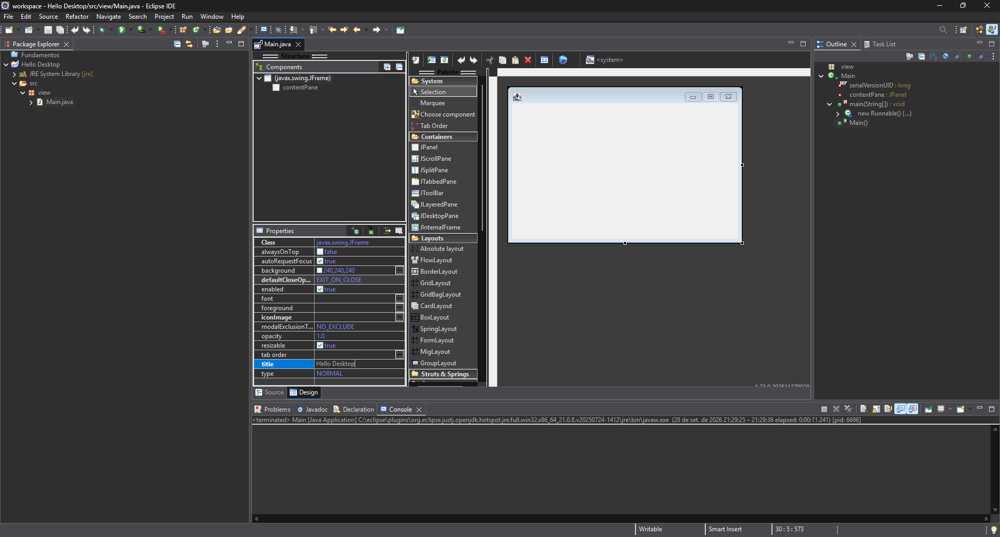
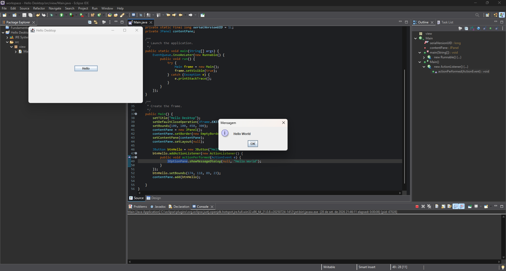

# Programação Orientada a Objetos

> **Data:** 28 de setembro de 2026

Começamos a trabalhar Programação Orientada a Objetos (POO) utilizando Java.

---

### Material de apoio

O professor disponibilizou um repositório no GitHub como material de apoio para as aulas:

**https://github.com/professorjosedeassis/javaSE**

---

## Eclipse IDE

Para desenvolver os programas em Java, utilizamos o Eclipse IDE.

O Eclipse é um ambiente de desenvolvimento utilizado para criar e executar aplicações Java.

### Configuração inicial

Primeiramente, foi criada uma pasta para servir como **workspace**.

No Eclipse:

File → Switch Workspace → Browse → selecionar a pasta criada (workspace) → Launch

Depois, foi aberta a perspectiva Java:

Window → Perspective → Open Perspective → Java



---

## Criando um projeto Java

Foi criado um novo projeto Java:

File → New → Java Project

O projeto foi chamado de: `Fundamentos`

Na configuração do projeto:

- JRE padrão do usuário;
- opções relacionadas ao Module foram desmarcadas;
- as demais configurações permaneceram no padrão.



Depois:

Next → Finish

### Criando um Package

Dentro do projeto `Fundamentos`, foi utilizado o diretório **src**.

Foi criado um novo Package:

src → New → Package

Nome: `fundamentos`

### Criando uma Class

Dentro do package fundamentos, foi criada uma nova classe:

`fundamentos` → New → Class

Foi habilitada a opção para criar o método principal:

`public static void main(String[] args)`

Foi utilizado um primeiro exemplo para testar a execução do programa:

```java
System.out.println("Hello World");
```

O programa exibiu:
```
Hello World
```



---

## Criando uma aplicação Desktop

Depois dos primeiros testes com Java, começamos a criar uma aplicação desktop.

Primeiramente, o projeto Fundamentos foi fechado:

Fundamentos → Close Project

Também verificamos no Eclipse Marketplace se o WindowBuilder já estava instalado:

Help → Eclipse Marketplace → pesquisar por WindowBuilder

O WindowBuilder foi utilizado para facilitar a criação da interface gráfica.

### Criando o projeto `Hello Desktop`

Foi criado um novo projeto Java:

File → New → Java Project

Nome do projeto: `Hello Desktop`

Dentro do src, foi criado um **package** chamado: `view`

### Criando uma janela com JFrame

Dentro do package view, foi utilizada a opção:

New → Other → WindowBuilder → JFrame

A classe foi chamada de: `Main`

Depois de finalizar, foi aberta uma janela em branco para a criação da interface.

O WindowBuilder possui uma área de Design, onde podemos visualizar e editar a interface gráfica.

A interface utiliza componentes do Java Swing, como o `JFrame` e outros componentes gráficos.

### Adicionando um botão

Na tela da aplicação, foi adicionado um botão (`JButton`).

Foram alteradas propriedades do componente, como:

- `Variable`
- `Text`
- `Title`

Também foi utilizado o `contentPane` para trabalhar com a área de conteúdo da janela.

O layout utilizado foi: Absolute



### Criando um evento para o botão

Depois de adicionar o botão, foi criado um evento para que uma ação acontecesse quando o usuário clicasse nele.

Caminho utilizado:

Botão → botão direito → Add Event → Action

No código do evento, foi utilizada uma mensagem:

```java
JOptionPane.showMessageDialog(null, "Hello World");
```

Assim, ao clicar no botão, uma janela de mensagem é exibida para o usuário.



---

## Exportando a aplicação

Depois de criar a aplicação, foram realizadas exportações do projeto.

### Javadoc

Caminho:

Hello Desktop → Export → Java → Javadoc

O Javadoc é utilizado para gerar uma documentação da aplicação a partir das informações presentes no código.

### Runnable JAR

Também foi realizada a exportação para um Runnable JAR.

Caminho:

Hello Desktop
→ Export
→ Java
→ Runnable JAR

Foi selecionada a classe principal (`Main`) e o arquivo foi salvo na Área de Trabalho com o nome: "Hello"

Dessa forma, foi gerado um arquivo JAR executável da aplicação.
