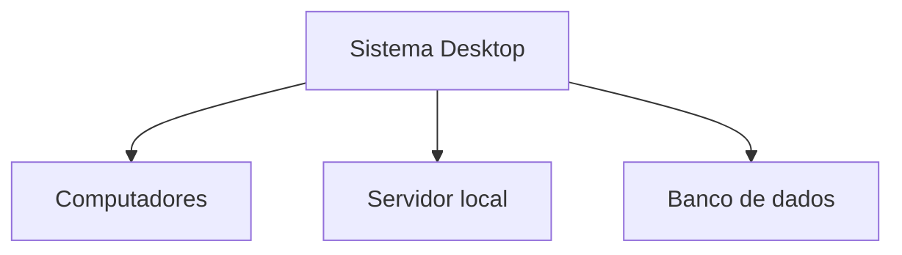

# Introdução ao Desenvolvimento Desktop

> **Data:** 28 de setembro de 2026

Desenvolvimento de Sistemas Desktop tem como objetivo executar processos de codificação, manutenção e documentação de aplicativos computacionais para desktop.

---

## Introdução

### O que é um sistema?

Um sistema é um conjunto de recursos utilizados para realizar determinadas funções e atender às necessidades de um usuário ou organização.

### Sistemas Desktop

Desktop refere-se a aplicações executadas em computadores, como PCs.

No comércio, por exemplo, sistemas desktop podem ser utilizados em lojas físicas para realizar atividades relacionadas ao funcionamento do estabelecimento.

Uma estrutura pode envolver:

Também podem existir instaladores para diferentes sistemas operacionais, como:

- Windows
- Linux
- macOS

---

## Relação com outras UCs

A UC-12 também utiliza conhecimentos trabalhados em outras UCs, como:

- Lógica de programação
- Banco de dados
- Programação Orientada a Objetos (POO)
